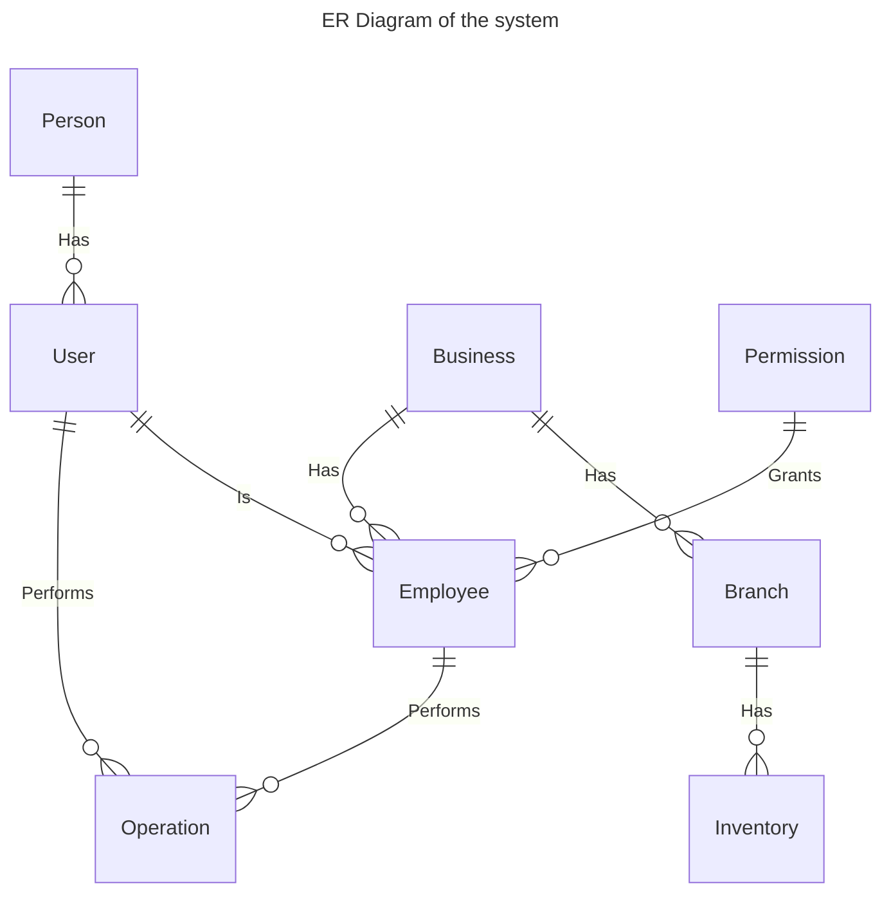
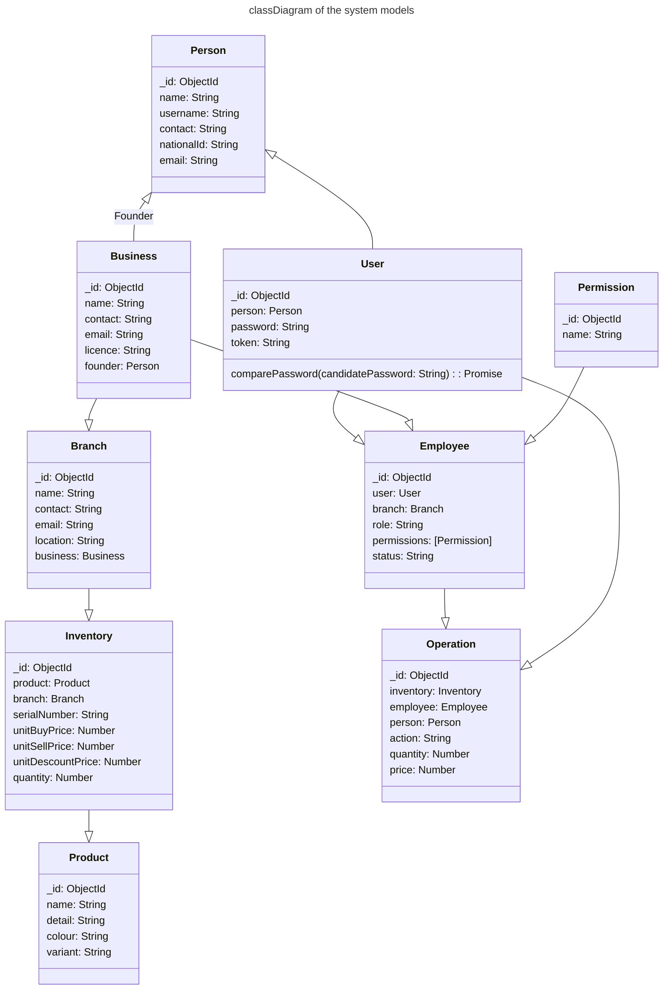

# Models
Models are the classes of typescript to typeguard teh data of several types whole system consists of following modal classes
 1) Person [Source](../../src/models/person.ts) - [Documentation](person.md) 
 2) User [Source](../../src/models/user.ts) - [Documentation](user.md)
 3) Branch [Source](../../src/models/branch.ts) - [Documentation](branch.md)
 4) Business [Source](../../src/models/business.ts) - [Documentation](business.md)
 5) Employee [Source](../../src/models/employee.ts) - [Documentation](employee.md)
 6) Inventory [Source](../../src/models/inventory.ts) - [Documentation](inventory.md)
 7) Operation [Source](../../src/models/operation.ts) - [Documentation](operation.md)
 8) Permission [Source](../../src/models/permission.ts) - [Documentation](permission.md)
 9) Product [Source](../../src/models/product.ts) - [Documentation](product.md)

